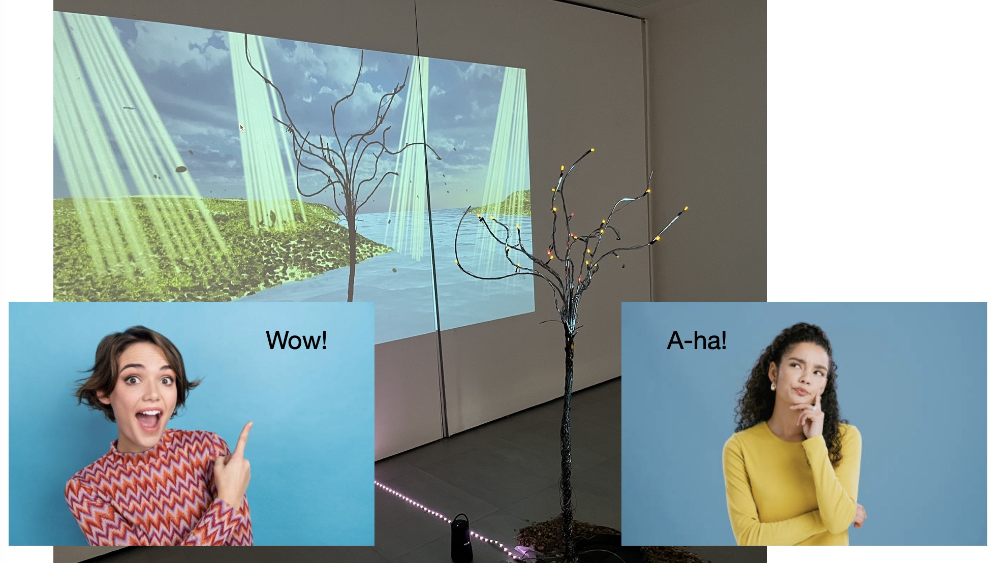
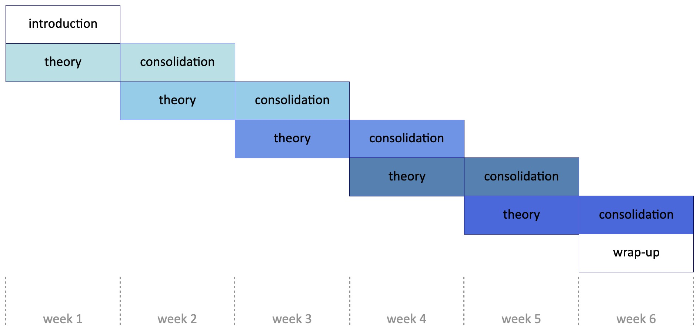

# Theory – semester 5

## Introduction: the narrative

What is *Time Based Design*? This question keep haunting the academy, its teachers and its students. One possible answer is that *Time Based Design* is using *interactive installations* to bring a message across. To accomplish this, designers in this field can work with screenplays, (projected) images, musical scores, digital media, film, light, et cetera. Either way, at some point the question about the *narrative* comes up.

 was able to talk about the cirle of life. (Borrowing Atoms, 2026)](imgs/sally-remy.jpeg)

Narrativity opens a lot of more or less complex phenomena, e.g. corporeality, mediality, representation, meaning, or materiality. You can look at all these subjects from an artistic, scientific, or sociological and philosophical perspective.

In this module, we try to do exactly that. In six sessions we are going to talk about six subjects that are all related to narrativity, about getting a message across or creating stuff that matters – in short: time based design.

## Theory for designers

Though it will always remain difficult to exactly pinpoint how a particular design-decision is exactly related to a theoretical model or idea, it is our hope and conviction that a solid grounding in the theory of art and design will eventually make for better designers. 

In this module, we will convey ideas, examples and a vocabulary that will enable you to look at and talk about your designs (and that of others) in another, more theoretical manner. This capacity will make for more layered designs, so that your audience will not only say 'wow!', but also 'a-ha!'.

## Structure of the meetings

Apart from the first meeting, every meeting starts with a short discussion of the text that you have read, and a presentation of one or two of the artistic case-studies that you have come up with.

After this, the next subject will be introduced in a theoretical manner. We will go over the relation of this subject to time based design, discuss the most important ideas and concepts and talk about their practical implication. After this theoretical introduction, some case-studies will be shown.

Every meeting thus *ends* with the theoretical framework of the subject, while the next meeting *starts* with the (practical) consolidation. This results in a nice tile-like organization of the whole module:

## Required preparation

Students are required to study the text that are given for each week. This means reading the text intensily, thinking about what the author is trying to convey, and to relate it to the subjects that we have discussed during class. This will result in a.g. notes, underlinings, questions, and objections. 

Students are also expected to come up with their own examples and case-studies of the subject at hand. You need to come up with *a few* (no more than five) movies, installations, artworks, and be able to describe why and in what way these work are related to the subject that we have discussed.

Based on this theory and these case-studies, students are finally asked to come up with a case-study of their own. You don't actually have to *realize* it - an artists impression will suffice.

The annotated texts, the case-studies that you have collected, and your own suggestion of a work will form the basis of [your portfolio]().

## Credits

This module is created and maintained by [Bart Barnard](https://bartbarnard.nl/cv/) using [mkdocs](https://www.mkdocs.org/) (for the moment), but without the use of AI. The source files of this module can be found [on github](https://github.com/bart314/VGV3).

