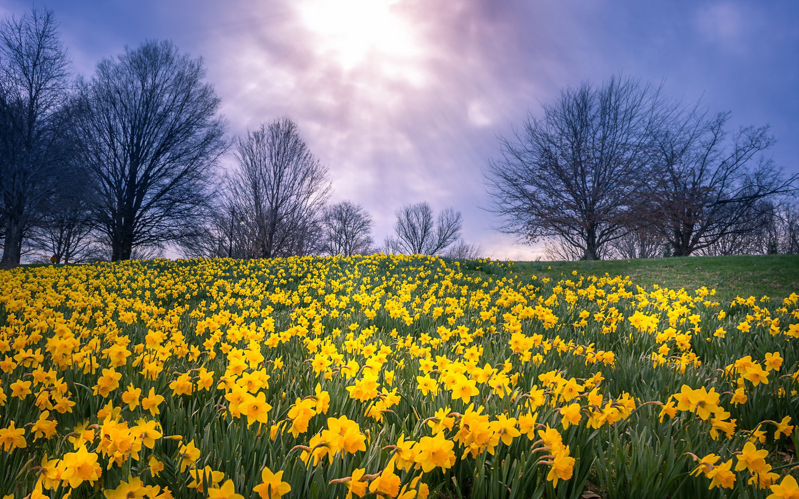

# I wondered lonely as a cloud

I wandered lonely as a cloud 
That floats on high o'er vales and hills, 
When all at once I saw a crowd, 
A host of golden daffodils; 
Beside the lake, beneath the trees, 
Fluttering and dancing in the breeze. 
 
Continuous as the stars that shine 
and twinkle on the Milky Way, 
They stretched in never-ending line 
along the margin of a bay: 
Ten thousand saw I at a glance, 
tossing their heads in sprightly dance. 
 
The waves beside them danced; but they 
Out-did the sparkling waves in glee: 
A poet could not but be gay, 
in such a jocund company: 
I gazed—and gazed—but little thought 
what wealth the show to me had brought: 
 
For oft, when on my couch I lie 
In vacant or in pensive mood, 
They flash upon that inward eye 
Which is the bliss of solitude; 
And then my heart with pleasure fills, 
And dances with the daffodils. 

- [Willam Wordsworth (1815)](https://en.wikipedia.org/wiki/William_Wordsworth)

