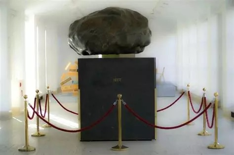
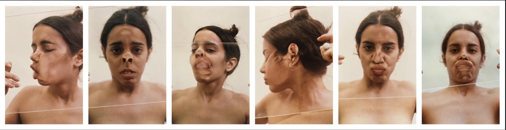

# Exercises for week 2

Make elaborations of the following exercises and bring them to the next class. We will start this class with an investigation of what people have come up with, and discuss several examples.

Your (consolidated) elaboration will be part of the final portfolio that you deliver at the end of the module.

## Investigative exercise

This is kind of a meditative exercise. Go sit somewhere and take a few minutes to really *experience* your experiences. What do you hear, see, feel, smell...? Try to feel your feet touching the ground, your back touching the backrest of your chair, your hands laying on your lap...

Come up with a way to convey the experiences you had. You can do this in writing, but also in the form of a drawing, a soundscape or a poem. This work can be seen as kind of a lab-report.

## Creative exercise

Come up with an installation that plays with the bodily relations with the world and the way that that relation is mediated by *machines* (or *technology* in general). You could e.g. make an installation in which the usual function of a technological artefact is changed or reversed, or an app that functions in a complete different way than usual. Use the conceptual framework that was discussed during the plenary part of this session.

Think about the exact venue that you would like to use, and the public you would like to reach – and be sure to accommodate your installation accordingly.

You don't have to actually *make* the installation. An artist impression will suffice.

## Reading exercise

**Mandatory reading**

Read the following text closely and critically (you can find both a physical and an online edition in the Minerva Mediatheek). As you go, process the text: annotate by jotting down questions or comments in the margins, underlining important points, circling keywords, and marking places you may want to revisit. Feel free to underline, scribble, or doodle.

- Hartmut Rosa, "The power of Art" in *Resonance* (Polity Press, 2019), 280-295.

Come up with one or two questions about this text that you want to discuss in class.

The processed text will be part of your portfolio. 

**Suggested reading**

- Kozel, Susan, "Telematics: Extending Bodies", in *Closer* (MIT Press, 2007), pp.84-91.

- Rosa, Hartmut, "Bodily relationships to the world" in *Resonance* (Polity Press, 2019), pp. 47-82.

- Whaley, Savannah, "Body as Artifact. A Value-Theoretical Reading of Ana Mendieta and Cassils", in *The Drama Review* (67:4, 2023), DOI: https://doi.org/10.1017/S1054204323000400

