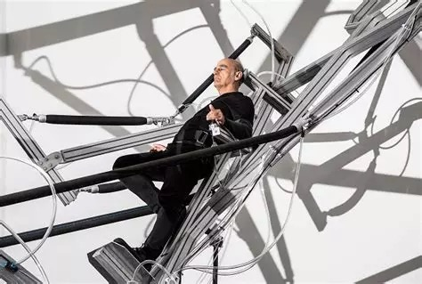

# Bodily Relations to the World

## Introduction

How do we relate to the world? The most obvious answer to this question is: *throught our body*. We *experience and perceive* the world using our different senses, we *move around* in the world using our limbs, and we *interact with the world* using our hands. 

Following [Merleau-Ponty]() we can say that human's basic relation with the world is characterized by a *universal sense of orientation*: there is an *up* and a *down*, a *front* and a *back*, a *left* and a *right*. It seems we *end* at our skin (our largest organ), and in such a way the skin can be seen as an *interface to the world*: it allow us to touch, feel and grasp, but on the other hand also to *be* touched, felt and grasped.

## Subjects

In this session, we are going to discuss the different bodily relations we have with the world. Specifically we will look at the following phenomena:

- birth, skin, self and world

- breathing

- eating and drinking

- voice, gaze, countenance

- walking, standing, sleeping

- laughing, crying, loving

## Case studies

Who | What | Where
---|---|---
Stellarc | Ear on Arm Suspension (2012) | [stellarc.org](https://www.stelarc.org/_activity-20325.php)
Stellarc | Reclining Stickman (2020) | [Youtube](https://www.youtube.com/watch?v=Vg-oHiKra9Y)
Marina Abramović | Rhythm 0 (1974) | [Youtube](https://www.youtube.com/watch?v=xTBkbseXfOQ&t=36s)
Marina Abramović | The Communicator (2012) | [Fondazione Arte CRT](https://fondazioneartecrt.it/en/artwork/the-communicator-marina-abramovic-2/)
Courtney Brown | Dinosaur Choir (2015) | [courtney-brown.net/](https://dino.courtney-brown.net/)
Marguerite Humeau | The Opera of Prehistoric Creatures (2015) | [Youtube](https://www.youtube.com/watch?v=wNoNQzjSiKM)
