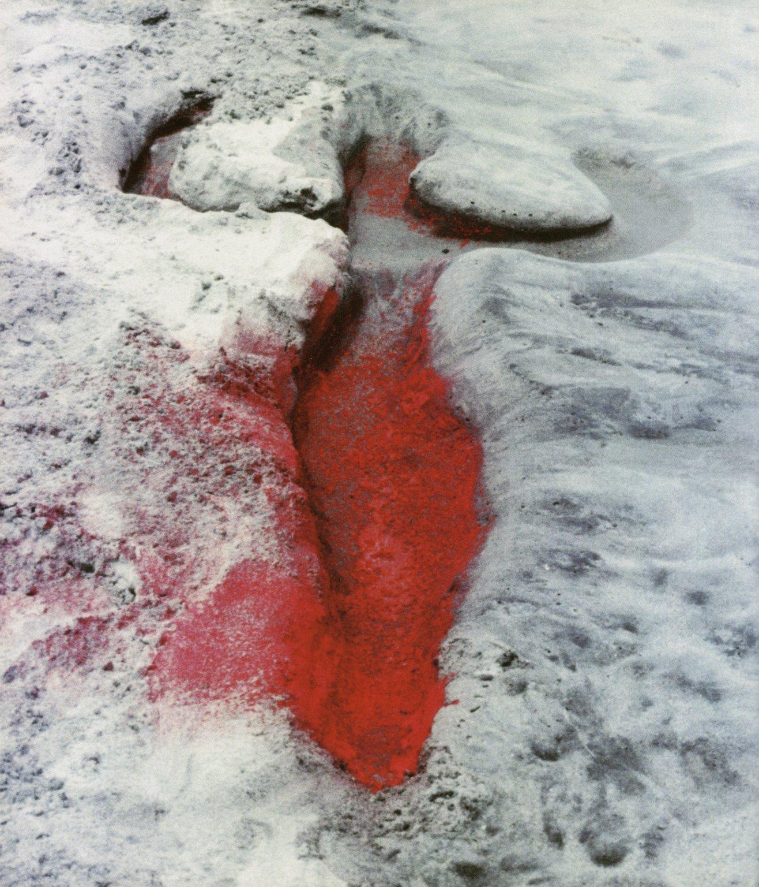

# Aarde, wees niet te streng

=== "NL"
    Aarde, hier komt een lichaam aan 
    waarin een koninklijke zon is opgegaan. 
    Achter de ogen scheen een zomermaand, 
    het middenrif liep vol zacht avondlicht 
    en bij de hartstreek rees een tovermaan. 
     
    De handen voelden water, streelden dieren, 
    de voeten kusten stranden, kusten steen. Inzicht 
    er sloop vreemd inzicht in het hoofd, de tong 
    werd scherp, er huisden vuisten in de vingers, 
    de hand bevocht brood, geld, liefde, licht. 
     
    Je kunt er heel wat boeken over lezen. 
    Je kunt er zelf één schrijven. Aarde, wees niet streng, 
    voor deze man die honderd sleutels had, 
    nu zonder reiskompas een pad aftast 
    en hier zijn eerste nacht doorbrengt. 

=== "EN"

    Earth, here comes a body approaching 
    in which a royal sun has risen. 
    Behind the eyes, a summer month was shining, 
    the diaphragm filled with gentle evening light, 
    and near the heart there rose an enchanted moon. 
     
    The hands felt water, stroked animals, 
    the feet kissed beaches, kissed stone. Insight 
    crept strangely into the head, the tongue 
    grew sharp, fists took up residence in the fingers, 
    the hand fought for bread, money, love, light. 
     
    You can read a great many books about it. 
    You can even write one yourself. Earth, be not too stern 
    with this man who had a hundred keys, 
    now feeling his way without a traveller’s compass 
    and spending his first night here. 
     
    (trans: BB in cooperation with ChatGPT)

– [Menno Wigman (2016)](https://nl.wikipedia.org/wiki/Menno_Wigman)

