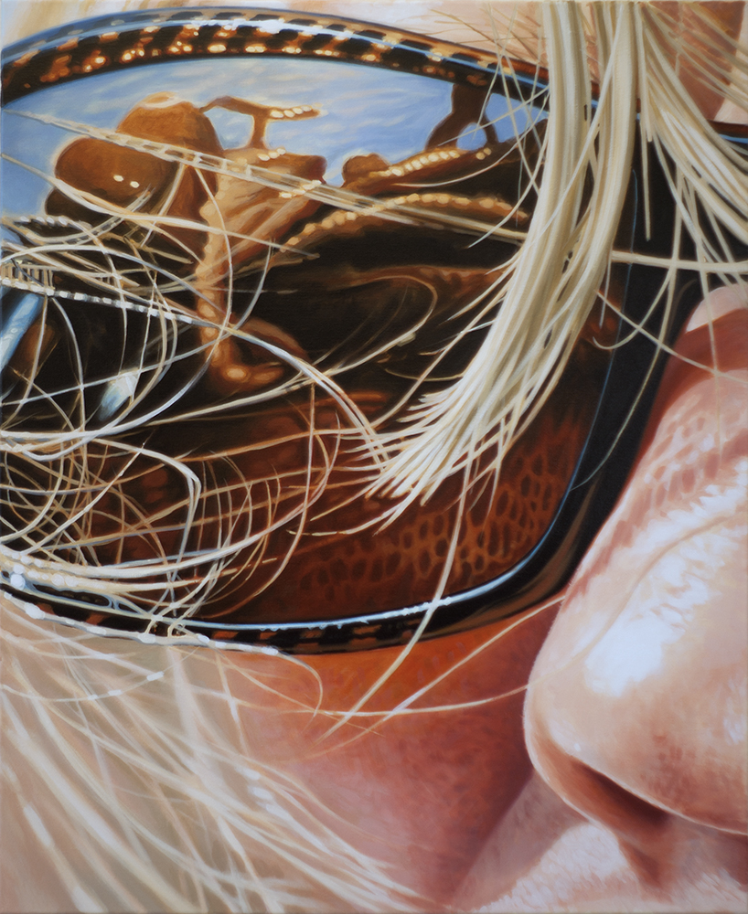

# Technological Relations to the World

## Introduction

After looking at our bodily relations with the world (both immediate and immediate), our next order of business is *technological* relations with the world. Of course, we have already seen that most of these relations involve *some* kind of technology, but the role technology plays in modern societies warrants its own scrutiny.

By way of introducion, we will circle back to the immediate relationship to the world, after which we will discuss several technological artefacts and their influence on out being-in-the-world and our perception of the world. Central to this discussion will be questions like *What is present?* or *What are we looking at?*.

## Subjects

- The end of our body

- The beginning of the world

- What is present?

- Two kinds of technology

## Case studies

The following case studies invite you to investigate our technological relationship with the world from an artistic point of view. They are not meant to talk about the technology that the arist uses, but specifically about how technology *mediates*, *constructs*, or *constitutes* our relationship with the world.

Who | What | Where
---|---|---
Sol LeWitt | Wall Drawing #1136 (2004) | [Youtube](https://www.youtube.com/watch?v=QG92R1VRxnI)
Anna Ridler | Mosaic Virus (2018) | [anneridler.com](https://annaridler.com/works/mosaic-2018)
Dornith Doherty | Archiving Eden (2019) | [Youtube (lecture)](https://www.youtube.com/watch?v=-sdscmqcZd0)
susanna kite | Everything I Say Is True (2017) | [Youtube](https://www.youtube.com/watch?v=a6J_m18LjZs)
Christa Sommerer and Laurent Mignonneau | Pico Scan (2000)) | [Youtube](https://www.youtube.com/watch?v=tQqVV5UBC7o&t=7s)

