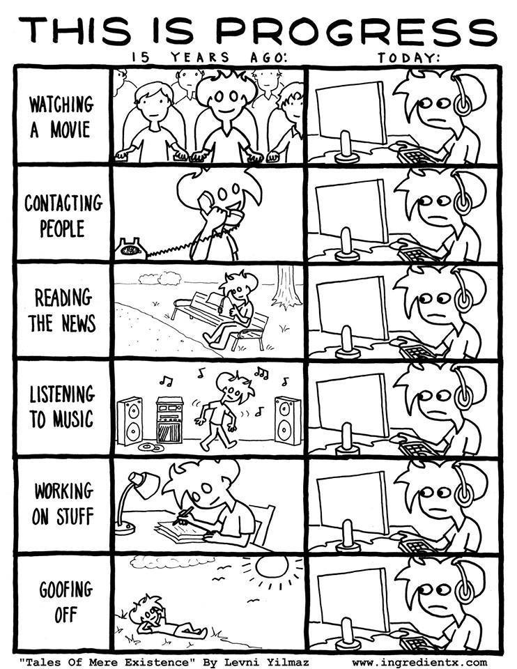

# Exercises for week 4

Make elaborations of the following exercises and bring them to the next class. We will start this class with an investigation of what people have come up with, and discuss several examples.

Your (consolidated) elaboration will be part of the final portfolio that you deliver at the end of the module.

## Investigative exercise

We have seen that our phone are 'on their way of the basis for our experience of art' (Rosa 2019, p.91). This calls for the questions what is being represented when we experience art in such a way. 

During the course of this week, try to find situations in which people are interacting or experiencing artworks throught their phones. Think about whether the artwork is present on the phone-screen or wether it is *represented* on the screen.

How does this work for other modalities than vision? What about touch or smell? What are we missing and what are we gaining when we experience artworks through our phone?

Document your findings in one way or another.

## Creative exercise

Make a small movie snippet of about thirty seconds – or find one online. The snippet should *not* have an all too clear narrative, but it should represent something that is familiar or relatable.

Now make at least *two different* versions of this snippet by adding or removing very small sections of it, or change the music that accompanies it. Try to find the *smallest possible change* with the *biggest effect*.

As an example, think about a snippet that shows a sunny beach. Just by changing the sound under this movie it can either represent a summer love story, the beaches on Sri Lanka on December 26, 2004, or the beaches of Normandy on the early morning of June 6, 1944. 

## Reading exercises

**Mandatory reading**

Hanneke Groentenboer, "Photorealism as Pictorial Reflection" and "Reflexive of what? Estes's Cityscapes" in *The Pensive Image* (Chigaco UP, 2020), 139-152.

**Suggested reading**

