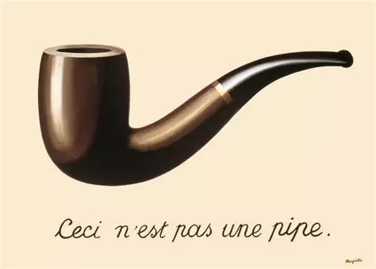

# 4. Reflection and Representation:

## Introduction

The previous two weeks we have focussed on the different forms of relationships that we have with the world. When we interact with the world, when a world *opens up* to us, we attach *meaning* to the things we encounter: they *represent* something.

This week, we will look into the different ways a thing can represent something. We will discuss the differences between and similarities of reflection and representation 

## Case Studies

Who | What | Where
---|---|---
Alvin Lucier | I am sitting in a room | [Youtube]()
Olivier Messiaen | Messiaen - Petites esquisses d'oiseaux: I. Le Rouge Gorge (1956) | [Youtube](https://www.youtube.com/watch?v=rbrVVB1m_lU)
Alfred Hitchcock | Shower scene from Psycho (1960) | [Youtube](https://www.youtube.com/watch?v=0WtDmbr9xyY)
Hans Zimmer | Theme from Interstellar (2014) | [Youtube](https://www.youtube.com/watch?v=kpz8lpoLvrA)
Refik Anadol | Machine Hallucinations (2021) | [refikanadol.com](https://refikanadol.com/works/machine-hallucination/)
Rafael Lozano-Hemmer | Pulse Room (2006) | [lozano-hemmer.com](https://www.lozano-hemmer.com/pulse_room.php)

